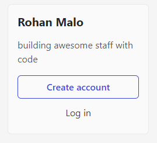
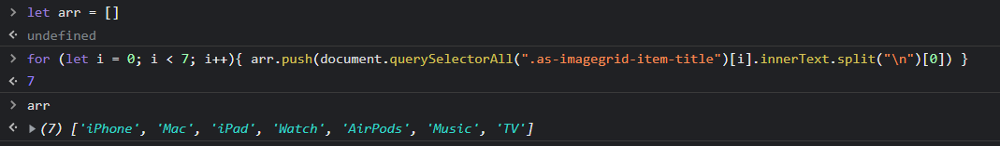
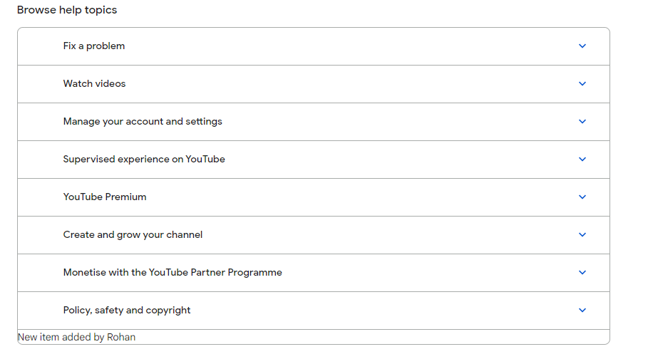
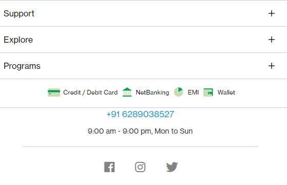
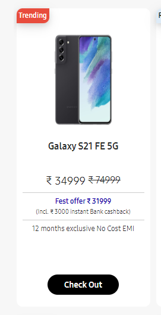
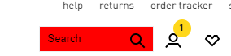
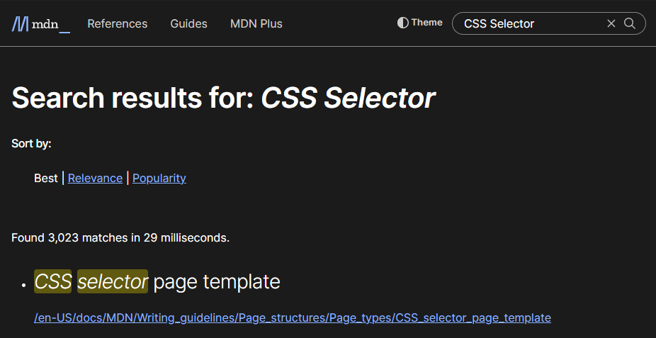
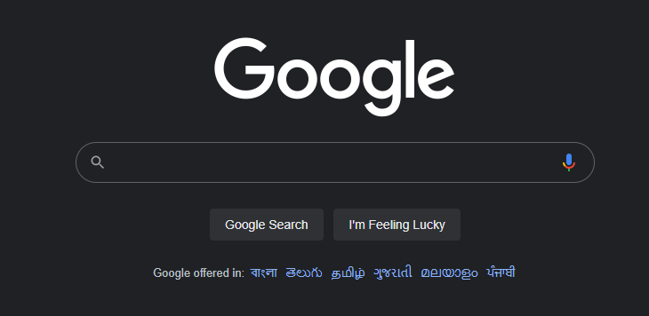
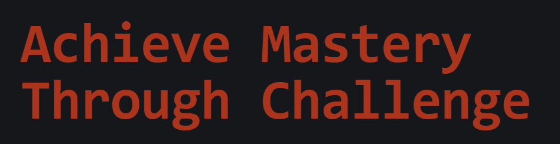
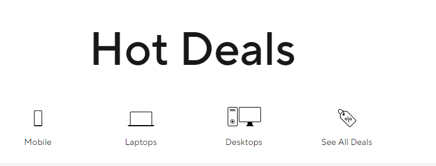

# Dom Manipulation Assignment

1. Webiste Name: [Dev To](https://dev.to/)

### Topics

    - Query Selctory, Inner HTML

### Sample Image


### Tasks

        Target the Top description div and change the DEV Community to <Your_Name> and description to your passion 

```javascript
document.querySelector(".side-bar .crayons-card .crayons-subtitle-2 ").innerHTML = "Rohan Malo"

document.querySelector(".side-bar .crayons-card .color-base-70 ").innerHTML = "building awesome staff with code"
```

### Output



--------------------------------------------------------------------------------------

2. Website Name: [Apple](https://support.apple.com/en-in)

### Task


### Fetch all the product name and store in an array

```javascript
let arr = []

for (let i = 0; i < 7; i++) {
    arr.push(document.querySelectorAll(".as-imagegrid-item-title")[i].innerText.splt("\n")[0])
     }

// Using for in loop 
```

### Output

['iPhone', 'Mac', 'iPad', 'Watch', 'AirPods', 'Music', 'TV']




---------------------------------------------------------------------------------------


3. Webiste Name: [Youtube Support](https://support.google.com/youtube/)

### Topics

    - Get Element By Id, Create Element, Create Text Node, Append Child

### Sample Image


### Tasks

     Add another FAQ 'My New FAQ' to the list

### Output

```javascript
let list = document.querySelector(".article .accordion-homepage")
​
newEle = document.createElement("section")
​
newEle.textContent = "New item added by Rohan"
​
list.append(newEle)

newEle.className = "parent" 

```




--------------------------------------------------------------------------------------------

4. Webiste Name: [OnePlus](https://www.oneplus.in/support)

### Topics

     Query Selector, InnerText

### Sample Image


### Tasks

      Change the contact number

### Output

```javascript
 document.querySelector(".one-tel-number ").innerText = "+91 6289038527"
```




--------------------------------------------------------------------------------------------

5. Webiste Name: [Samsung](https://www.samsung.com/in/offer/online/samsung-fest/)

### Topics

       getElementById, createElement, InnerText, append, setAttribute

### Sample Image


### Tasks

     Target the main div of card and change the Button text to Check out

### Output


```javascript
document.querySelector(".diwali-deals-product-sale-btn").innerText = "Check Out"
```




--------------------------------------------------------------------------------------------

6. Webiste Name: [Adidas](https://www.adidas.co.in/)

### Topics

    -   Query Selector, Event listeners, Changing Styles

### Sample Image


### Tasks

     Target the search box and on hover change thebackground color to red.

### Output

```javascript
let search = document.querySelector(".searchinput___19uW0")

search.addEventListener('mouseover', () => { search.style.background = "red" });
```



--------------------------------------------------------------------------------------------

7. Webiste Name: [MDN Web Docs](https://developer.mozilla.org/en-US/)

### Topics

       Form, Value, Submit

### Sample Image


### Tasks

     To Search a topic in the MDN Search bar.
     First add a text to search in the search bar and then hit the submit search button to search the docs using DOM

### Output

```javascript
let search = document.querySelector('#top-nav-search-input')

search.value = "CSS Selector"

document.querySelector('.search-form').submit()
```




--------------------------------------------------------------------------------------------

8. Webiste Name: [Google](https://www.google.com/)

### Topics

       Remove Elements

### Sample Image


### Tasks

     Remove alternate languages from the home page languages listed

### Output

```javascript

let lang = document.querySelector('#SIvCob').children

for(ele in lang){
     if( ele % 2 === 0 ){
          lang[ele].remove()
     }
}

```



--------------------------------------------------------------------------------------------

9. Webiste Name: [Code Wars](https://www.codewars.com/)

### Topics

       Change Font Family, Color of Text.

### Sample Image


### Tasks

    Change the font family of the text to monospace and text color to the logo’s background color.

### Output

```javascript
let str = document.querySelector('.display-heading-1')

str.style.fontFamily = "monospace"

str.style.color = "#AB341D"
```




--------------------------------------------------------------------------------------------

10. Webiste Name: [Freecodecamp](https://www.freecodecamp.org/)

### Topics

       querySelector, mouseover, click eventListener,  callback function, style,

### Sample Image


### Tasks

    Target the button and change background colour on mouseover

### Output


```javascript
let str = document.querySelector('.btn-cta-big .login-btn-text')

str.addEventListener("mouseover", () => { str.style.background = "red" } )

```


--------------------------------------------------------------------------------------------

11. Webiste Name: [realme](https://www.realme.com/in/)

### Topics

       querySelector,style,background-image

### Sample Image


### Tasks

    change the realme logo to ineuron logo

### Output


```javascript
document.querySelector('.icon-logo').style.backgroundImage = "url('https://ineuron.ai/images/ineuron-logo.png')"
```


--------------------------------------------------------------------------------------------


12. Webiste Name: [Github](https://github.com/)

### Topics

       querySelector,style,background-Color

### Sample Image


### Tasks

     change the background colour of the button to blue.

### Output


```javascript
document.querySelector('.btn').style.background = "blue"
```


--------------------------------------------------------------------------------------------

13. Webiste Name: [Hackerrank](https://www.hackerrank.com/)

### Topics

       querySelector,innerHtml

### Sample Image


### Tasks

Target the top description and change “Matching developers with great companies” to ‘JSBOOTCAMP“.

### Output

```javascript
document.querySelector('.fl-heading-text').innerHTML = "JSBOOTCAMP"
```


--------------------------------------------------------------------------------------------

14. Webiste Name: [Asus](https://www.asus.com/in/)

### Topics

      querySelector,style,font-size

### Sample Image


### Tasks

       change the fontsize of “Hot Deals” to 80px

### Output


```javascript
document.querySelector('.HotDealsAll__Heading__2fIbe').style.fontSize = "80px"
```




--------------------------------------------------------------------------------------------

15. Webiste Name: [Dell](https://www.dell.com/en-in/shop/deals/laptop-deals?gacd=10415953-9016-5761040-285981356-0&dgc=ST&gclid=Cj0KCQjwguGYBhDRARIsAHgRm4-XUDMhhVNyHXb3s1gY4ZBzORr_d9Se-buhJwy7asyUe7YdqEA11eEaAt6UEALw_wcB&gclsrc=aw.ds&nclid=BxjBlpBQsX6pjSHh-L8YYSU77EpfXRkG1AGMB5Wbeu386ykspfrPDnfx_DdFau20)

### Topics

      querySelector,style.textAlign

### Sample Image


### Tasks

       Convert the text “G15 Gaming Laptop” from left to right

### Output

```javascript
document.querySelector('.ps-title a').style.float = "right"
```


--------------------------------------------------------------------------------------------

16. Webiste Name: [Vercel](https://vercel.com/)

### Topics

     querySelector,innerHTMl

### Sample Image


### Tasks

      change the heading “Start with the developer” to “Start with Scratch”

### Output

```javascript
document.querySelector('.section-title_title__VEDfK').innerHTML = "Start with Scratch"
```


--------------------------------------------------------------------------------------------

